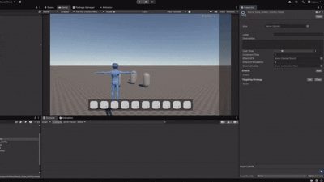

# Modular Ability System for Unity

A modular, extensible ability system demonstrating clean architecture principles, data-driven design, and decoupled gameplay logic in Unity (C#).

## Table of Contents
- Overview
- Features
- Demo Media
- Installation
- Quick Start
- Core Concepts
- Creating Abilities
- Targeting Strategies
- Effects System
- Timers Architecture
- UI Layer
- Extensibility
- Performance Notes
- Debugging & Development
- Roadmap
- Contributing
- Credits / Assets Used
- License

## Overview
This package provides a flexible framework for implementing player abilities: casting flows, targeting paradigms (self, area-of-effect, projectile, chained), cooldown management, and runtime effects (instant, over time). It is designed to minimize coupling with scene objects and leverage ScriptableObjects + strategy/factory patterns.


## Features
- ScriptableObject-driven ability definitions (`AbilityData`).
- Pluggable targeting strategies (Self, Mouse AOE, Projectile, Chain, Etc...).
- Runtime effect factories (e.g., Knockback, Heal Over Time) via `IEffectFactory` → `IEffect`.
- Custom lightweight timer framework integrated into Unity PlayerLoop (no per-timer MonoBehaviours).
- Drag & drop ability assignment UI with cooldown visualization tween (PrimeTween).
- Projectile system for ability delivery.
- Chain targeting with optional link VFX & reusable collider buffer.
- Clean separation of concerns: data, targeting, execution, visual feedback.
- Easily extendable with new strategies, effects, and UI components.

## Demo Media
- Custom editor: 
> 
- Equipping:
>
- Using and cooldown:
>

## Installation
1. Clone or download the repository.
2. Open in Unity (2022.3+ recommended; earlier versions may work but not tested).
3. Ensure required input actions exist (`PlayerInputActions` asset included). If you already have an input setup, wire ability usage to numeric key actions (0–9).
4. Optionally import dependencies (PrimeTween, NaughtyAttributes, TextMeshPro is built-in, others for visuals like CFXR/Toony Colors Pro).
5. Play the demo scene under `Assets/AbilitySystem/Scenes/Demo`.

## Quick Start
1. Create an Ability asset: Right-click in Project → Abilities → AbilityData.
2. Assign icon, label, description, cast time, cooldown.
3. Add effect factories (e.g., KnockbackEffectFactory, HealEffectOvertimeFactory) via the custom inspector.
4. Choose a targeting strategy (SelfTargeting, MouseAOETargeting, ProjectileTargeting, ChainTargeting).
5. Add the ability to a player slot via: `PlayerAbilityCaster.EquipAbility(ability, slotIndex)` or drag & drop in UI.
6. Press the mapped numeric key to cast. Observe cast animation, targeting flow, effect execution, cooldown.

## Core Concepts
| Concept | Description |
|---------|-------------|
| AbilityData | ScriptableObject describing ability metadata & behavior components. |
| AbilitySlot | Holds an AbilityData, manages cooldown, exposes events to UI. |
| PlayerAbilityCaster | Orchestrates input → cast timer → targeting strategy start. |
| TargetingStrategy | Abstract pattern for selecting targets & executing ability (polymorphic). |
| IEffectFactory / IEffect | Factory creates runtime effect that applies to IDamageable targets. |
| Timers | Non-MonoBehaviour timers updated centrally (CountdownTimer, IntervalTimer). |
| IDamageable | Interface for entities that can take damage, heal, and receive effects. |
| UI Layer | Inventory of abilities + slots with drag & drop and cooldown visuals. |

See `Docs/architecture.md` for more detail.

## Creating Abilities
1. Use custom inspector to Add Effect → choose effect type (e.g., HealEffectOvertimeFactory). Set parameters.
2. Set targeting strategy: Add Targeting Strategy → choose (Self, AOE, Projectile, Chain). Configure radius/speed/VFX.
3. Optional: Provide VFX prefab & duration for per-target effect visuals.
4. Save asset. It can now be equipped via UI or code.

### Example (Code)

> Equipping an ability at runtime:
```csharp
// Equip first slot at runtime
public class EquipExample : MonoBehaviour {
  public PlayerAbilityCaster Caster;
  public AbilityData SomeAbility;
  void Start() { Caster.EquipAbility(SomeAbility, 0); }
}
```

## Targeting Strategies
- SelfTargeting: Immediate execution on caster if it implements `IDamageable`.
- MouseAOETargeting: Displays preview circle, waits for click to apply to all `IDamageable` in sphere.
- ProjectileTargeting: Spawns projectile; impact triggers ability effects.
- ChainTargeting: Sequentially links multiple targets with optional link VFX (LightningArc, Beam, ParticleTrail).

To add a new strategy, subclass `TargetingStrategy`, implement `Start()`, optionally `Update()`, and call `RaiseTargetingComplete()` when finished.

### Example (Code)
> Creating a custom targeting strategy:
> 
```csharp
/// <summary>
/// Executes the ability immediately against the caster if it implements <see cref="IDamageable"/>.
/// </summary>
public class SelfTargeting : TargetingStrategy
{
    /// <summary>Starts self targeting; applies ability instantly.</summary>
    public override void Start(AbilityData ability, TargetingManager targetingManager, GameObject caster)
    {
        this.Ability = ability;
        this.TargetingManager = targetingManager;

        if (caster.transform.TryGetComponent<IDamageable>(out var target))
        {
            ability.Execute(caster, target);
        }

        RaiseTargetingComplete();
    }

    /// <summary>Cancels (no-op for self) ensuring cooldown can begin.</summary>
    public override void Cancel()
    {
        _isTargeting = false;

        RaiseTargetingComplete();
        TargetingManager.ClearCurrentStrategy();
    }
}

```

## Effects System
Effects are runtime objects encapsulating state (e.g., remaining ticks). Factories produce new instances per execution.
- Instant (KnockbackEffect): Immediately applied and completed.
- Over Time (HealEffectOvertime): Uses `IntervalTimer` to tick healing.
Lifecycle:
1. AbilityData iterates factories → CreateEffect()
2. Target's `ApplyEffect` registers completion and calls `effect.Apply(caster, target)`.
3. Effect raises `OnCompleted` → target cleans up reference.

### Example (Code)
> Creating a custom effect factory and runtime effect:
```csharp
// <summary>
/// Runtime instance of a SomeEffect
/// </summary>
public struct SomeEffect : IEffect<IDamageable>
{
    private float _data;

    public event Action<IEffect<IDamageable>> OnCompleted;

    public SomeEffect(float data)
    {
        _data = data;
        OnCompleted = null;
    }

    public void Apply(GameObject caster, IDamageable target)
    {
        target.DoSomething(_data);
        OnCompleted?.Invoke(this);
    }

    public void Cancel()
    {
        OnCompleted?.Invoke(this);
    }
}

/// <summary>
/// Factory for creating SomeEffect instances
/// </summary>
[Serializable]
public class SomeEffectFactory : IEffectFactory<IDamageable>
{
    public float Data = 10f;

    public IEffect<IDamageable> CreateEffect()
    {
        return new SomeEffect(Data);
    }
}
```

## Timers Architecture
`TimerBootstrapper` injects `TimerManager.UpdateTimers` into Unity's PlayerLoop. `Timer` derivatives register/deregister automatically on `Start()`/`Stop()`. This avoids creating one MonoBehaviour per timer and reduces overhead.

## UI Layer
- `AbilityUI`: Builds draggable list from all `AbilityData` assets (inventory). Press `I` to toggle.
- `DraggableAbilityUI`: Drag an ability icon onto a slot.
- `AbilitySlotUI`: Reacts to slot events; uses PrimeTween to animate cooldown fill.

## Extensibility
Add new gameplay features by implementing one of:
- New `TargetingStrategy`: Cone, Raycast, Pattern-based.
- New `IEffectFactory` + runtime `IEffect` for DOT, Shield, Slow, etc.
- Alternate visualization layers (audio manager or pooled VFX system).
- Additional editor tooling (validation, preview gizmos).

## Performance Notes
- Central timer update reduces per-object overhead and GC.
- `ChainTargeting` uses `Physics.OverlapSphereNonAlloc` with a reusable buffer.
- Cooldown animations leverage tweening library (PrimeTween) without custom coroutines.

## Debugging & Development
- Log output shows damage/heal events (PlayerHealth, Enemy).
- Use the custom inspector to inspect targeting strategy configuration.
- Press `I` to toggle ability inventory.

## Roadmap
- Object pooling for projectiles and VFX.
- More built-in effect factories (DamageOverTime, Slow, Shield, ResourceGain).
- Editor gizmos for targeting areas & chain links.
- Multiplayer considerations (authoritative server events).

## Contributing
1. Fork the repo; create a feature branch.
2. Follow existing code style; add XML docs for new public APIs.
3. Include demo GIFs if adding visible gameplay features.
4. Open a PR describing changes & testing steps.

## Credits / Assets Used
- PrimeTween (tweening for UI animations).
- NaughtyAttributes (inspector attributes) by Denis Dyukov.
- CFXR (Cartoon FX Remaster) VFX.
- Toony Colors Pro / shader & VFX styling by Jean Moreno.
- KinoBloom (post-processing) by Keijiro Takahashi.
- Polygon Starter Pack by Synty Studios.
- Parts of Improved Unity Timers by git-amend.

All respective assets are property of their creators; ensure you have appropriate licenses/imports before using them in production.

## License
MIT License – see [LICENSE](LICENSE).

---
Feel free to open issues for feature requests or questions.
